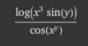

# ENSIMISMARSE

Ensimismarse is a Rust library that allows basic manipulation of mathematical expressions. So far, elementary expressions can be created and then differentiated, simplified, and evaluated using the functions provided.

## Overview

This project is still in its early stages. However, almost any elementary function encountered in a first-year calculus course can be differentiated using this libary. Any composition of the following operations and functions can be differentiated

- Addition, Subtraction, Multiplication, Division
- Trigonometric Functions (sin,cos,tan,sec,csc,cot)
- Hyperbolic Trig Functions (cosh,sinh,tanh,sech,csch,coth)
- Exponential and Logarithm
- Powers of x, N'th Roots of x

Functions, represented by the <code>Expr</code> struct in the library, can also be evaluated given a vector containing the numerical values of the variables. They may also be simplified (although this feature is still limited in its scope).

## Usage

To use this library, you can do the following

Run this command `cargo new my_project`
Then cd into the newly made directory `my_project` and edit the file `my_project/Cargo.toml` to have the following content

```toml
[package]
name = "my_project"
version = "0.1.0"
edition = "2021"

[dependencies]
ensimismarse = {path="../ensimismarse"}
```

Then edit `my_project/src/main.rs` to have the following content

```rust
use std::collections::HashMap;
use std::f64;
use ensimismarse::differentiation::differentiate;
use ensimismarse::structs::{Expr, Operation, TrigOp};
fn main() {
    let a: Expr<f64> = Expr::Variable('x');
    let b: Expr<f64> = Expr::Variable('y');
    let xy_vals = HashMap::from([('x', 6.9), ('y', 0.3)]);
    let funky_boi = Expr::Operation(Box::new(Operation::Div((
        Expr::Operation(Box::new(Operation::Log(Expr::Operation(Box::new(
            Operation::Mul(vec![
                Expr::Operation(Box::new(Operation::Pow((a.clone(), Expr::Constant(3.0))))),
                Expr::Operation(Box::new(Operation::Trig(TrigOp::Sin(b.clone())))),
            ]),
        ))))),
        Expr::Operation(Box::new(Operation::Trig(TrigOp::Cos(Expr::Operation(
            Box::new(Operation::Pow((a.clone(), b.clone()))),
        ))))),
    ))));
    let mut funky_derivative = differentiate(funky_boi.clone(), 'x');
    funky_derivative.simplify();
    let c_val = funky_derivative.evaluate_expr(&xy_vals);
    println!("{}", c_val);
}
```

Then you can run `cargo run` anywhere in the `my_project` directory, and the standard output will print out the derivative of the function

with respect to `x`

This example demonstrates all the features of the library as of now and hopefully makes the usage clear

## Getting Help

Send me a DM on Discord at <code>floofydoggo</code>
